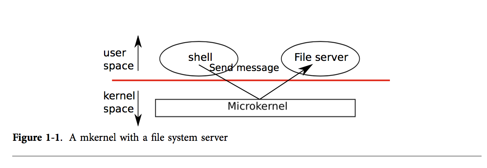
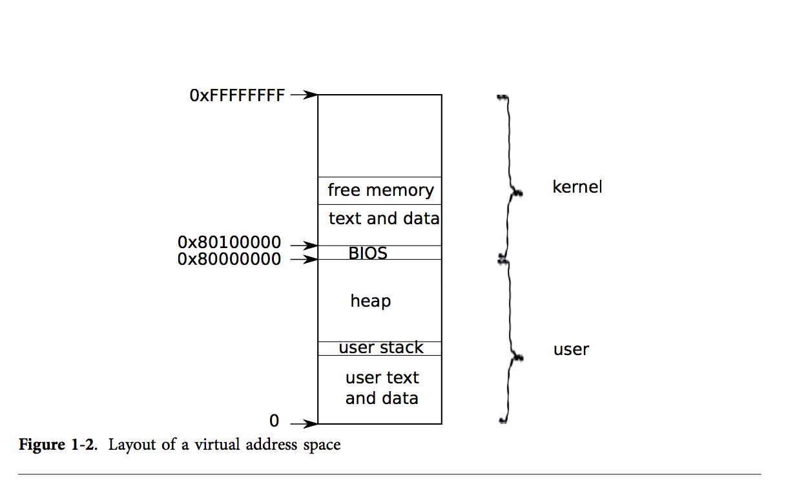
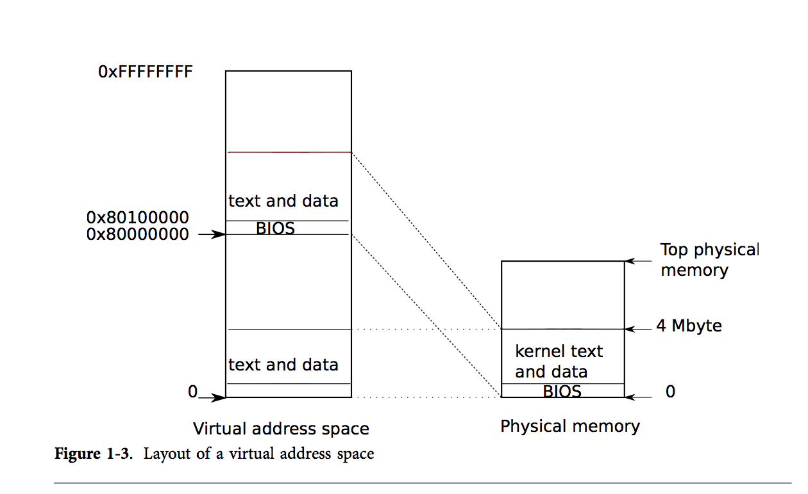
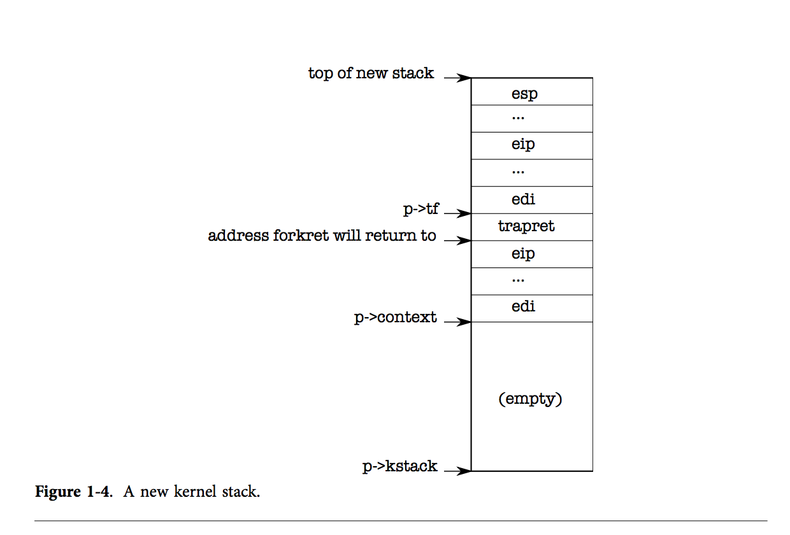

# 第一章
## 操作系统结构
操作系统的核心需求在于同时支持多个活动，比如进程可以调用在第零章中描述的系统调用接口fork来创建新进程，因此操作系统必须在这些进程中分时共享资源，比如进程的数量多于硬件的核心数的时候，操作系统必须保证所有进程都正常运行，因此就必须配置资源和隔离进程。也就是说，如果进程有bug或者运行失败，不能影响哪些不依赖此失败进程的其他进程的运行。然而要求进程之间完全隔离却有些太苛刻了，毕竟进程之间还需要相互通信，比如管道；也就是说，操作系统必须满足三个要求：多路复用、隔离以及交互。

本章主要概括了操作系统是如何满足上述的三个要求的。存在很多方案满足这些需求，但是本书中主要集中讨论的是以宏内核为中心的主流设计，该设计也被运用在unix操作系统中。本章通过追踪xv6启动是首进程的创建过程过来介绍xv6的设计，这样做也描述了xv6主要抽象概念的的具体实现、如何交互的，以及如何满足多路复用、隔离和交互的要求。xv6提供了标准操作以实现代码复用，竭力避免首进程的特殊情况。后续章节将详细的探索各类抽象的细节。

xv6运行在Intel 80386或者x86的普通PC平台上，多数底层的功能(比如进程的实现)只针对x86架构。本书确保读者只需要少量的汇编层面的编程只是，也会介绍是x86架构的思想。附录A概要地总结了PC平台。

## 抽象物理资源
当你首次接触操作系统的时候，或许你首先会思考的问题是为什么需要操作系统呢？我们完全可以把图0-2中的系统调用以库的方式实现，这样每个应用程序都可以根据需求量身定制所需的资源，也可以直接和硬件资源交互，通过最佳的方式来使用这些资源（比如达到很高或者可预测的性能）。某些嵌入式或者实时操作系统确实使用这样的组织方式。

库文件方式的缺点是，如果有多个应用程序同时运行，那么这些应用都必须循规蹈矩，比如每个应用都必须周期性的释放资源，以便其他应用程序运行。这种分时合作的机制在建立在应用程序都相互信任以及程序没有BUG的基础上。但通常情况是应用程序彼此之间并不信任，程序也不能做到完全没有BUG，因此我们需要更加有效的合作机制来提供更健壮的隔离。

为了实现更健壮的隔离，必须能有效禁止应用程序直接访问计算机敏感资源，以及将资源抽象为服务。比如，应用程序只能通过open、read、write以及close系统调用与文件系统交互，而不是直接在磁盘扇区进行读写。文件系统提供路径名称，以便操作系统（接口的实现者）来管理磁盘。

类似的，操作系统在不同进程间切换，这种切换对于进程是透明的，必要时保存和恢复寄存器的状态，因此应用程序不用担心分时共享，即使应用程序处于无限循环中，这种透明性也允许操作系统共享处理器。

再举个例子，Unix进程使用exec来构建它的内存映象，而不是直接和物理内存交互。这样操作系统可以决定在内存中的何处存放进程映象，如果内存不足，操作系统甚至可以将某些进程的数据存储在磁盘中。exec利用便捷的文件系统为用户存储可执行的程序映象。

多数Unix进程之间的交互都是通过文件描述符来完成，文件描述符不仅抽象了许多细节（比如管道中的数据和文件存储的地方），并且通过这种方式来简化交互。比如，比如管道中的某个应用运行失败，内核会在管道中为下个进程写入文件结束的标志。

正如你看到的，为了同时提供便捷性以及健壮的隔离，图0-2中的系统调用都是精心实现设计的。unix接口不是资源抽象的唯一方法，但事实证明这是最佳的方式。

## 用户模式，系统模式，以及系统调用
健壮的隔离需要在应用程序和操作系统之间建立明确的边界。如果应用程序不小心犯了错误，我们也不能让操作系统也挂掉。实际上，操作系统是能够清理运行失败的应用程序，然后继续运行其他应用程序。应用程序不能修改操作系统的数据结构和指令，也不能访问其他进程的内存等等。

处理器为健壮的隔离提供硬件上的支持，比如，和许多其他处理器相同，x86处理器有两种执行指令的模式，分别是内核模式和用户模式。在内核模式下，处理器允许执行特权指令，比如，磁盘（或者其他I/O设备）读写等特权指令。如果应用在用户模式下尝试执行特权指令，处理器将拒绝执行指令，必须切换到内核模式，以便内核中的软件将清理该应用程序，因为它做了不该做的事情。运行在晕乎模式下的应用程序只能执行用户模式指令（比如加减法等），而运行在内核模式下的软件能够执行特权指令，运行在内核空间（或者内核模式）的软件称为统称为内核。

当应用程序想要向磁盘读写的时候，必须切换到内核去处理，因为应用程序本身不能执行I/O指令。处理器提供给了特殊的指令将处理器从用户模式切换到内核模式，并进入内核指定的内核指定的地方开始执行（x86处理器提供了int指令完成模式切换）。一旦处理器切换到内核模式，内核先验证系统调用的参数，决定应用程序请求的指令是否被允许，然后选择拒绝还是执行调用。设置内核模式切换的入口非常重要，因为如果应用程序能够决定内核的入口，那么恶意应用程序就能够从不需要参数验证就进入内核模式。

## 内核组织
一个至关重要的设计问题是操作系统的那些部分应该在内核模式下运行，其中一种方式就是整个操作系统都在放置在内核中，所有的系统调用的实现都在内核中运行，这种组织方式称为宏内核。

在这种组织方式中，整个操作系统都运行在完全特权模式下，同时也是非常便利，因为操作系统设计者不必选择操作系统的那些部分不需要在完全特权模式下执行，因此很容让操作系统的不同部分协同工作。比如，操作系统的缓冲区可以被文件系统和虚拟内存系统共享。

宏内核的劣势在于操作系统的不同部分之间的接口通常比较复杂（正如我们在本文中看到的），因此操作系统的开发人员非常容易犯错误。在宏内核中错误是致命的，因为内核中的错误通常会导致整个内核都挂掉。如果内核挂掉，那么计算机将停止工作，所有的应用程序也会跟着挂掉，计算机必须再次重启。

为了减少内核中犯错误的风险，操作系统设计者可以最简化运行在内核模式下的代码，二在用户模式下执行大量的代码，这种内核设计称为微内核。

图1-1揭示了宏内核的设计，图中的文件系统作为用户进程运行。操作系统服务作为进程运行简称为服务。为了允许进程和文件服务交互，内核提供了进程间的通信机制把用户进程的消息发送给其他进程。比如，如果shell应用程序想要读写文件，它发送消息给文件服务后等待响应。

宏内核中内核接口由启动应用程序、发送消息和访问设备硬件等底层函数组成。多数操作系统服务都运行在用户模式下，这种组织方式内核相对简洁。

在现实的世界中，到宏内核和微内核两种设计方式都存在。比如，Linux是宏内核，尽管部分OS功能作为用户层服务（比如视窗系统）。Xv6也是是宏内核的实现，遵循多数Unix的设计。因此，在xv6中，内核接口关联操作系统接口，内核实现了整个操作系统。xv6提供的服务并不多，因此它的内核甚至比微内核还小。

## 进程概述
xv6中的隔离的基本单元是进程（其他Unix操作系统也是如此）。进程抽象防止进程破坏或者嗅探其他进程的内存、CPU以及文件描述符等，同时也防止进程破坏内核本身，更不能绕过内核的隔离机制。内核必须小心地实现进程抽象，因为满是bug或者恶意应用可以绕过内核和硬件做坏事。内核实现进程的机制包括用户/内核模式标志，地址空间以及线程分时。

为实现进程强制隔离，进程抽象让程序以为有自己拥有私有机器，进程提供给程序的私有内存或者地址空间不能被其它进程读写。进程也让程序像在自己的CPU上执行程序指令。

Xv6使用分页表（这是由硬件实现）来为每个进程分配自己的地址空间。x86分页表将虚拟地址（x86指令操作的地址）映射到物理地址（处理器送到主内存中的地址）。

Xv6维护为每个进程的内存空间分配的分页表，如图1-2所示，地址空间包括了从0开始的进程用户内存，首先是指令，紧接着是全局变量，然后栈空间，最后是进程可以按需扩展的堆区域（用于malloc）。

进程的内核指令、数据和用户程序内存都同样被映射进程的地址空间中，当进程请求系统调用，系统调用在进程内核映射的地址空间中运行。该组织方式以便内核的系统调用代码能够直接访问用户的内存。为给用户内存留出大量的空间，xv6将内核映射到高地址0x80100000。

Xv6在proc结构体中维护进程的状态信息，其中最重的内核状态就是分页表、内核栈以及运行状态。我们将使用p->xxx的记号来引用proc结构体中的元素。

每个进程都有执行的线程来执行进程的指令。线程可以被挂起随后再恢复。为了在进程间透明的切换，内核必须挂起当前运行的线程才恢复其他进程中的线程。多数线程的状态存储在线程的线程栈中。每个进程有两个栈空间：用户栈和内核栈(p->kstack)。当进程在执行用户指令的时候，只有用户栈可用，其内核栈为空；当进程进入内核的时候，内核代码执行在进程的内核栈中。然而进程在内核模式下的时候，它的用户栈仍然含有保存着的数据，但是不能使用。进程的线程交替使用用户栈和内核栈。内核栈被隔开，因此即使进程有损坏的用户栈，但是内核依旧可以执行指令。

当进程请求系统调用时，处理器切换到内核栈，提升硬件的权限等级，开始执行实现系统调用的内核代码。当系统调用完成，从内核返回到用户空间：硬件降低权限等级，切换回用户栈，并且在系统调用指令执行完后继续执行用户指令。进程的线程也可以被内核中的I/O等待阻塞，在I/O完成后重新开始恢复运行。

p->state表示进程是否被分配、已经准备好可以运行、I/O等待或者退出等。

p->pgdir保存了x86硬件制定格式的进程分页表，当执行进程的时候，xv6会让分页硬件使用进程的p->pgdir。进程的分页表页记录了分配给进程的内存物理页的地址。

## 代码：首地址空间
为了让xv6的组织结构更加具体，我们来看看内核如何创建首地址空间(用于内核自身的运行)，如何创建和启动首个进程，以及进程如何执行首次系统调用。通过跟踪这些过程，我们将详细了解xv6是如何隔离进程。而提供健壮地隔离的第一步就是让内核在自身的地址空间中运行。

接通电源后开始初始化，从磁盘上加载boot loader到内存中并执行。附录B详细地解释了该过程。xv6的boot loader从磁盘上加载xv6内核，并从entry(行1144)开始执行。当内核开始运行时，x86的分页硬件还没开启，此时虚拟地址直接映射到物理地址。

boot loader将内核加载到内存中物理地址为0x100000处，之所以不在0x80100000处加载内核的原因是小机器可能没有这么高的物理地址，而不在0x0处加载是因为物理地址范围0xa0000:0x100000用于I/O设备。

为了让内核其余部分运行，entry设置好分页表，将虚拟地址从0x80000000映射到物理地址0x0处(见图1-2)。将两段虚拟地址映射到相同的物理内存范围是比较常见的分页表使用方式，并且我们将会看到更多类似的例子。

分页表定义在main.c(行1412)，我们将在第二章中详细分析分页表，但简单来说就是分页表项0将虚拟地址0:0x400000映射到物理地址0:0x400000。此时映射要求entry尽可能在地址执行，但最终会被移除。

分页表项512将虚拟地址KERNBASE:KERNBASE+0x400000到物理地址0:0x400000，在entry完成后此entry将被内核使用,将存储指令和数据的高地址空间映射到boot loader加载内核内核的低物理地址。此映射严格限制内核指令和数据的空间为为4M。

回到entry中，加载entrypgdir的物理地址到控制寄存器%cr3中，%cr3中的值必须是物理地址。在%rc3保存entrypgdir的虚拟地址也没有意义，因为分页硬件还不知道如何映射虚拟地址，也没有分页表。符号entrypgdir引用内存中的高地址空间，并且宏V2P_WO减去KERNBASE以便找到物理地址。为了开启分页硬件，xv6在控制寄存器%cr0中设置CRO_PG标志。

分页开启后内核仍旧在低地址空间执行指令，之所以能工作是因为entrypgdir映射到地址空间。当分页开启后，如果xv6从entrypgdir忽略entrypgdir中的第0项，在尝试执行指令时计算机就会崩溃。

现在entry需要将执行转交给内核的c代码，并在高地址空间中运行。首先让栈指针%esp指向作为栈的内存地址。包括栈在哪的所有符号都是高地址，即使地址映射被移除，但栈仍旧有效。最终entry将跳转到main中，main也是高地址。需要非直接跳转，否则汇编器会生成PC相关的直接跳转，转而执行低地址空间中的那个main方法。main方法不能返回，因为在栈中没有返回。现在内核main函数的高地址中运行。

## 代码：创建首进程
现在我们来看看内核是如何创建用户级进程并确保它们被隔离。

在main(1317)初始化设备和子系统后，它将创建首个称为userinit(行2502)的进程，userinit的第一个动作就是调用allocproc。allocproc的任务就是在进程表中分配一个proc结构体，并初始化部分内核进程执行需要的进程状态。allocproc在每个新进程被创建的时候调用，而userinit则是只在首进程中被调用。allocproc扫描进程表，查找状态为UNUSED(行2461-2463)的proc结构体。当发现一个未使用的proc结构后，allocproc设置其状态为EMBRYO来标记该proc结构体已经被使用了并且给进程一个唯一的pid(行2451-2468)。接下来，allocproc尝试为进程的内核线程分配一个内核栈。如果内存分配失败，allocproc将其状态重置回UNUSED并且返回0作为失败信号。

现在allocproc必须设置新进程的内核栈。allocproc被编写为可以在fork和创建首进程时都能使用，为新进程设置特殊准备的内核栈以及用于返回首次调用的用户空间的寄存器。特殊准备的内核栈的布局如图1-4所示。allocproc通过设置返回程序计数器值来完成这部分工作，该程序计数器值将会导致新进程的内核线程可以在forkret或者trapret中执行。内核线程将使用从p->context拷贝的寄存器内容开始执行。因此设置p->context->eip为forkret将会导致内核线程在forkret(2788)开始执行。这个函数将会返回到栈底的任何地址。上下文切换代码(行2958)设置栈指针指向p->context的结束位置。allocproc在栈中存储p->context的内容，然后放置指向trapret的指针，也就是forkret返回的地方。trapret从存储在内核栈顶部的值中恢复用户寄存器，并跳转到进程中(行3277)。此步设置在普通的fork和创建首进程都是相同的，尽管后者会导致进程在用户空间位置为0的地址而不是fork的返回地址执行。

正如我们将在第三章会看到，控制从用户软件到内核的转换的方式是通过中断机制来实现的，中断机制用于系统调用、中断以及异常。当进程运行时，不论何时切换到内核，硬件和xv6陷入入口代码会在进程的内核栈上保存用户寄存器。userinit在新栈顶写入，看起来就像是进程通过中断(行2516-2522)进入内核一样，所以对于从内核返回到进程的用户普通代码也能正常工作。trapframe结构体保存着用户寄存器。如图1-4所示，现在新的进程内核栈已经完全准备好了。

首进程开始执行一小段程序(initcode.S;(行8400))。进程需要物理内存来存储该程序，程序需要拷贝到内存中，并且也需要分页表来映射用户空间地址到非配的内存中。

userinit调用setupkvm(行1837)为进程创建只映射内核内存的分页表。我们将在第二章中详细学习该方法，但是更高的层次来看，setupkvm和userinit创建了如图1-2所示的地址空间。

首进程用户空间内存的初始内容是从initcode.S中编译的。作为内核构建进程的一部分，链接器以二进制代码的方式嵌入在内核中，并且定义了两个特殊的符号，_binary_initcode_start和_binary_initcode_size,标明其位置和大小。Userinit通过调用inituvm将二进制代码拷贝到新进程的内存中，inituvm分配一个物理内存，映射虚拟地址0到该内存中，并且拷贝二进制到物理分页中(行1903)。

userinit设置带有初始用户模式状态的陷入(trap)帧：寄存器%cs包含了用于SEG_UCODE段运行在特权模式下的段选择器，%ds、%es也是相似地使用SEG_UDATA。%eflags的FL_ID位设置为允许硬件中断；我们将在第三章在此研究这些内容。

栈寄存器%esp被设置为进程的最大合法虚拟地址，p->sz。指令指针设置为initcode的入口处，地址0。

函数userinit设置p->name为initcode主要用于调试。设置p->cwd为进程的当前工作空间。我们将在第六章详细的研究namei。

一旦进程初始化完毕，userinit就通过设置p->state为RUNNALBLE来标记它可以用于调度了。

## 代码：运行首进程
现在首进程的状态已经准备好了，是时候可以运行了。在main调用userinit后，mpmain会调用scheduler开始运行进程(行1367)。Scheduler(行2708)搜索p->state为RUNNABLE的进程，此时只存在initproc。设置各cpu的proc变量为找的可运行进程，并且调用switchuvm告知硬件开始使用目标进程的分页表(行1886)。当在内核中执行的时候会切换该表分页表，因为setupkvm会导致所有进程的分页表都对内核代码和数据都有相同的映射。switchuvm也设置任务状态段SEG_TSS，让硬件在进程的内核栈中执行系统调用和中断。我们将在第三章中在此研究任务状态字段。

scheduler现在设置p->state为RUNNING，并且调用swtch(行2958)来执行到进程内核线程的上下文切换。swtch首先保存当前寄存器。当前上下文不是一个进程而是特殊CPU调度上下文，因此scheduler告知swtch保存当前硬件寄存器到各CPU的cpu->scheduler中，而非进程的内核线程上下文。swtch然后加载目标内核线程(p->contetn)中保存的寄存器到x86的硬件寄存器中，包括栈指针和指令指针。我们将在第五章详细研究swtch。指令ert从栈中移除目标进程的%eip，完成上下文切换。现在处理处理在进程p的内核栈中运行。

allocproc首先设置initproc的p->conteext->eip为forkret，因此ret开始执行forkret。在首次调用过程中，forkret不能从mian中运行初始化函数，因为它必须在有自己的内核栈的进的上下文中运行。随后，forkret返回。在p->context被移除后，Allocproc安排栈顶的字为trapret，所以现在trapret开始执行，%esp设置为p->tf。Trapret使用pop指令从陷入帧(trap frame)中恢复寄存器，正如swtch在内核栈中做的一样。popal指令恢复通用寄存器，然后popl恢复%gs,%fs,%es和%ds。addl指令跳过trapno和errcode两个字段。最后，iret指令从栈中弹出%cs,%eip,%flags,%esp和%ss。陷入帧的内容已经转换到CPU状态，因此处理开始在陷入帧中制定的%eip开始执行。对于initproc，也就是虚拟地址0，initcode.S的首指令。

在此时，%eip的值为0，%esp的值为4096，都是进程地址空间的虚拟地址，处理器的分页硬件开始将虚拟地址映射到物理地址。allocuvm设置进程的分页表，以便虚拟地址0映射到分配给进程的物理内存地址，并且设置一个标志(PTE_U)告知分页硬件允许用户代码访问分配的内存。实际上是userinit设置%cs的低位，在CPL=3下运行进程的用户代码，CPL=3表示用户代码只能在PTE_U下使用分页，并且不能修改敏感硬件寄存器，比如%cr3。因此进程被限制只能使用它自身的内存。

## 首个系统调用：exec
现在我们已经明白内核是如何提供进程隔离的了，接下来看看用户级进程是如何重新进入内核，请求它本身不能执行的服务的。

initcode.S的首个动作就是调用exec系统调用。正如我们在第零章中看到的，exec用新程序来替换当前进程的内存和寄存器，但是保留它的文件描述服，进程id，以及父进程不改变。

Initcode.s(行8409)在栈中保存$argc.$init和$0三个值，然后设置%eax为SYS_exec，开始执行int T_SYSCALL：请求内核运行exec系统调用。如果进展顺利，exec永远不会返回，开始运行名为$init的程序，指向NUL结尾的字符串/init(行8422-8424)，参数是argv的命令参数数组。数字的末端的0表示结束。如果exec失败并且返回，initcode循环调用被定义为不能返回的exit系统调用。

这些代码手动构造了一个看起来像普通系统调用的首个系统调用，我们将在第三章看到。同样避免为首进程做特殊处理，以便xv6在提供通用操作服务时也可以重用代码。

第二章将会详细的说明exec的实现，但是在更高层次来讲，它使用从文件系统中加载的/init二进制文件代替initcode。此时initcode(行8400)完成，并且进程开始运行/init。如果需要，Init(行8510)创建新的终端设备文件，并且作为文件描述服0，1，2打开。然后开始循环执行终端shell，处理孤儿僵尸进程直到shell退出，就这样整个操作系统就运行起来了。

## 现实世界
多数操作系统都采用了进程的概念，并且大多都和xv6相似。真实操作系统可能会使用在常数时间内找到空闲的proc结构体的算法，而不是allocproc中线性搜索的算法。xv6是为了简化才这样设计的。

xv6的地址空间布局的缺点是不能够利用大于2GB的物理RAM。是可以修复这个问题的，尽管最好的方法就是直接切换到64位地址的机器上。

## 练习
1.在swtch设置断点。使用gdb不断跟踪直到返回到forkret，然后使用gdb的finish来处理trapret，然后stepi直到虚拟地址的initcode。

2.KERNABASE限制了单个进程可以使用的内存大小，在有4GB的RAM机器上让人比较心烦。是否可以提高JKERNBASE来允许进程使用更多的内存？
