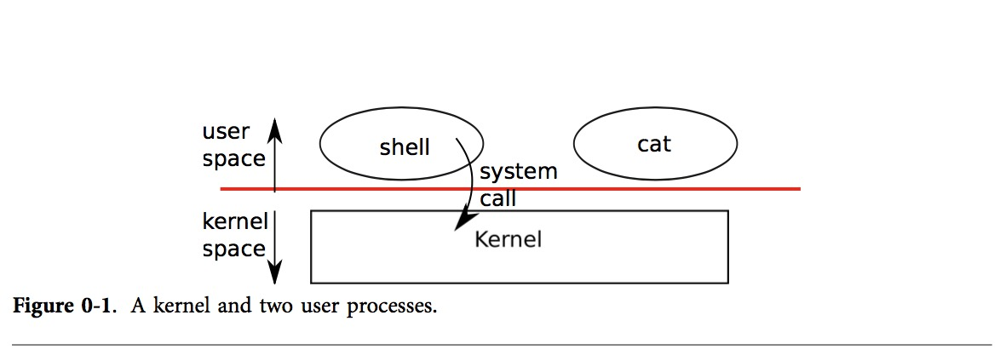
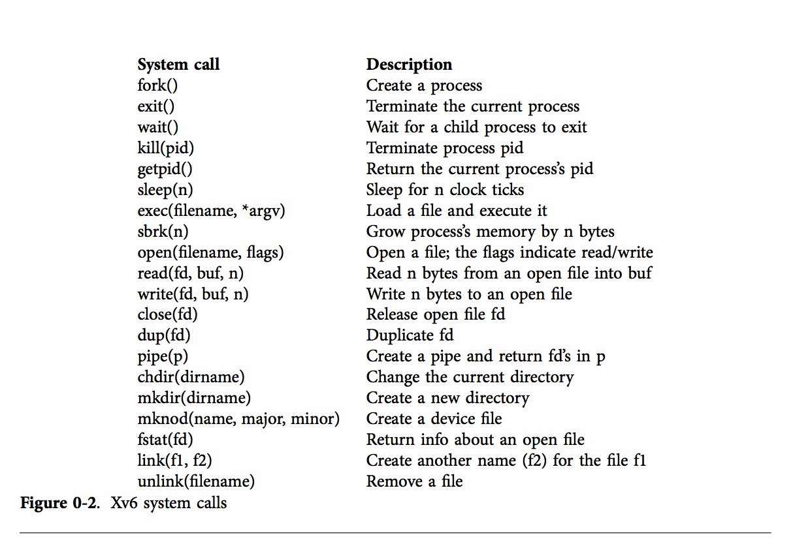

# 第一章
## 操作系统接口
  操作系统的工作就是在多个程序间共享计算机资源，以及提供一组比裸机所支持的更加有用的服务。操作系统管理和抽象底层硬件，在多个同时运行的程序间共享硬件资源，如此以来，比如像文字处理这类软件也就无需关心其使用的硬盘是什么类型；最后，操作系统提供了一种可控的方式供程序交互，以便让这些程序能够共享数据或者协同工作。
  
  操作系统通过接口向用户程序提供服务，而设计良好的系统接口却充满困难和挑战。一方面，我们想要设计简洁、小巧精干的接口，因为这样的设计实现起来更加容易；但是另一方面，我们也想为用户提供更多丰富的功能；因此想要消除这种思想上对立，就只能着手设计依赖于很少但可以组合起来提供通用型服务的机制（译注：也就是《Unix编程艺术》一书说的“致力于提供一套‘机制，而不是策略’”）。
  
  本书中使用具体的操作系统实例来揭示操作系统基本概念，xv6系统提供了由Ken Thompson和Dennis Ritchie在设计unix系统时引入的基本接口，同时也模拟了unix的内部设计。Unix系统只提供了有限的接口，但这些接口的组合却产生令人惊奇的通用性。Unix接口的设计是如此的成功，以至于许多现代操作系统，比如BSD，Linux，Max OS X，Solaris，甚至Microsoft Windows都有类Unix接口；因此深入理解xv6的基本原理是掌握上述这些现代操作系统的起点。
  
  如图0-1所示，xv6的一个名为内核的特殊的程序向每个运行中的进程提供服务，每个进程都包括指令、数据和栈，其指令主要实现程序的计算，数据则是指令执行作用的对象，而栈则是用来组织进程调用。
  
  
  
  当进程需要使用系统服务的时候，会调用操作系统接口中称为系统调用的程序；系统调用进入内核后执行相应的服务，最好返回用户进程；因此进程总是在用户空间和内核空间交替执行。
  
  内核使用CPU的硬件保护机制来确保在用户空间执行的进程只能访问它自己的内存空间。内核在硬件特权模式下执行需要内核实现这些保护，而用户进程则在没有特权的模式下运行。当用户程序执行系统调用的时候，硬件会提升权限等级并开始执行预设在内核中的方法。
  
  内核提供的系统调用程序集合也就是用户程序能够看到的操作系统接口。xv6内核只提供了传统unix内核提供的服务和系统调用的子集。图0-2列出了xv6所有的系统调用。
  
  
  
  本章概括地描述了xv6提供的进程、内存管理、文件描述符、管道以及文件系统等服务，通过代码片段来演示它们使用，也讨论了如何使用传统类unix系统中的主要用户接口shell程序。通过分析shell的系统调用的过程，揭示系统接口是如何被精心设计的。
  
  事实上shell并无任何特殊之处，也非内核的组成部分，仅仅是一个不断地读取用户的输的命令后开始执行的普通程序，因此也展现了系统调用接口的强大能力。正因为shell只是普通的程序，也就是说它是可以替换的，结果就是在现代类Unix操作系统中有不同的shell可供用户选择，而每种shell都由有自己的用户接口和脚本特性。xv6的shell本质上是unix的Bourne shell的简单实现；其实现可以在行(8550)找到。
  
## 进程与内存
  xv6进程由用户空间内存（指令，数据和栈）以及内核私有的进程状态组成。xv6能够分时处理，进程在可用的CPU上不断切换执行。当进程没有执行的时候，xv6会保存它的CPU寄存器，而在进程再次切换回来的时候恢复寄存器的值。内核给每个进程都关联唯一标识符pid。
  
  一个进程通过fork系统调用来创建新的进程，调用的进程称为父进程，而Fork创建的新进程称为子进程，父子进程的内存空间中的内容完全相同，Fork在子父进程都会返回。在父进程中，fork返回子进程的pid，而在子进程中则返回0。比如下面的程序片段：
  
  ```c
  int pid = fork();
  if (pid > 0) {
     printf("parent: child=%d\n", pid);
     pid = wait();
     printf("child %d is donw\n", pid);
  } else if (pid == 0) {
     printf("child: exiting\n");
     exit();
  } else {
     printf("fork error\n");
  }
  ```
  exit系统调用引起子进程停止执行，并释放内存和打开的文件等资源。wait系统调用返回当前进程已经退出的子进程的pid；如果子进程都没有退出，wait会一直等待。上述实例的输出为：
  
  ```c
  parent: child=1234
  child: exiting
  ```
  也可能是其他的顺序，取决于父子进程谁先调用printf。子进程退出父进程返回，父进程打印
  
  ```c
  parent: child 1234 is done
  ```
  尽管子进程初始化的时候和父进程有相应的内存内容，但是父子进程是在不同的内存空间和寄存器中执行，父子进程各自修改变量并不会相互影响。例如，wait的返回值存储在父进程的pid中，不会改变子进程中的pid变量，子进程中的pid仍然是0；
  
  exec系统调用从文件系统中的特定格式文件中加载新的内存映象，其指定了文件的那部分存储指令，那部分存储数据，以及指令开始的位置。xv6使用的ELF格式会第二章中详细讨论；当exec执行成功后，它不会返回到被调程序，而是从ELF文件头指定入口处的指令开始执行。exec执行需要俩个参数，可执行文件的名称和参数字符串，例如：
  
  ```c
  char *argv[3];
  argv[0] = "echo";
  argv[1] = "hello";
  argv[2] = 0;
  exec("/bin/echo", argv);
  printf(exec error\n");
  ```
  上述代码片段使用/bin/echo程序替换被调程序，使用参数echo hello来运行。多数程序会忽略程序名称参数。
  
  xv6使用上述的调用为用户运行程序。shell的主结构很简单，参见main(8701)函数，其主循环使用getcmd来读取用户的输入，然后调用fork，它会创建一份新的shell程序拷贝。当子进程运行命令的时候，父进程调用wait。例如，如果用户在shell中输入"echo hello"，runcmd会以“echo hello“为参数调用，runcmd运行实际的命令。对于”echo hello“，它会调用exec(8626)函数，如果exec执行成功，子进程立即执行echo中的指令而非runcmd函数。echo进程会在某个执行点调用exit退出，父进程从wait中返回到main(8701)中。你或许会想为何不将fork和exec合并为一个调用，后面我们会明白将进程创建和程序加载分开是明智的设计选择；
  
  xv6都隐式地分配大多数用户内存空间，fork需要分配子进程拷贝父进程内存的所需的内存，而exec会分配足够的内存来存储了执行文件。进程在运行时如果需要更多内存（可能是调用malloc），可以调用sbrk(n)来增加n比特内存空间；sbrk返回新内存空间的地址；
  
## I/O与文件描述符
  文件描述符就是用来表示内核管理的进程读写对象的小整数，进程通过打开文件、文件夹或者设备来获取文件描述符。为了简便，我们经常说“文件”就是的文件对象描述符。文件描述符接口抽象了文件、管道和设备之间的不同，让它们看起来都像比特流。
  
  在xv6内部，内核使用文件描述符作为每个进程表中的索引，因此每个进程都有一个私有文件描述符空间。通常进程从文件描述符0（标准输入）中读取数据，将输出写到文件描述1（标准输出）中，或者将错误输出写到文件描述2（标准错误）中。随后我们会明白shell正式利用该约定实现I/O重定向和管道。shell总是确保这3个文件描述符是打开的(8707)，通常状态下这3个文件描述服默认就是console设备；
  
  read和write系统调用从打开的文件描述符读取或者写入。系统调用read(fd, buf, n)最多从文件描述符fd读取n比特到buf中，并返回实际的读取比特数。每个文件描述符所引用的文件都有对应的偏移，read调用从当前文件偏移开始读取，向前偏移读取的比特数，接下来每次读取将会返回上次读取位置紧跟着的那个比特，直到文件中不能在继续读取数据，read返回0作为文件结束的信号。
  
  系统调用write(fd, buf, n)将buf中的n比特写入到文件描述符fd中，并返回写入的比特数。当错误发生的时候，写入的比特数小于n。和read一样，将数据写入当前文件偏移的位置，然后向前偏移写入的比特数，每次write都紧接着上次的位置开始写入。
  
  下面的程序片段（也就是cat程序的实质），从标准输入中拷贝数据到标准输出中，如果此过程发生错误，就将消息写入到标准错误中；
  
  ```c
  char buf[512];
  int n;
  
  for(;;){
     n = read(0, buf, sizeof buf);
     if (n == 0)
       break;
     if (n < 0) {
     	fprintf(2, "read error\n");
     	exit();
     }
     if (write(1, buf, n) != n) {
     	fprintf(2, "write error\n");
     	exit();
     }
   }
  ```
  需要重点指出的是，cat不知道是自己从console，文件还是管道中读取，相似的，cat也不知道自己是向console，文件或者管道输出。cat程序中的文件描述符的使用约定是，文件描述符0作为输入，文件描述符1作为输出，这样能简化cat的实现；
  
  系统调用close释放文件描述符，并标记以后可以被open，pipe或者dup系统调用重新使用（见下）。新分配的文件描述符总是当前进程未使用最小文件描述服数。
  
  文件描述服和fork相互作用，使得I/O重定向可以非常容易的实现。Fork拷贝父进程的文件描述符表到自己的内存空间中，因此此时父子进程有完全相同的文件描述符。系统调用exec替换被调进程的内存空间，但会保存其文件描述符表。这个行为允许shell通过fork来实现I/O重定向，重新打开指定的文件描述符(注：就是使用其他的文件描述符作为其标准输入、输出或者错误输出)后执行新的程序。shell运行命令cat < input.txt的简单版本的代码如下：
  
  ```c
  char *argv[2];
  
  argv[0] = "cat";
  crgv[1] = 0;
  
  if (fork() == 0) {
  	close(0);
  	open("input.txt", O_RDONLY); // 关闭了标准输入，最小的文件描述符数是0，因此打开的文件的描述符为0
  	exec("cat", argv);
  }
  ```
  子进程关闭文件描述符0后，open会使用描述符0作为新打开的input.txt文件描述符，因为此时0是最小可用的文件描述符。然后cat使用指向input.txt的文件描述符0作为标准输入。
  
  xv6中shell的I/O重定向完全采用这种方式来实现的。回想前面被fork的子shell的代码，runcmd将会执行exec调用来加载新的程序。现在应该清楚为什么将fork和exec分开为不同的系统调用是非常棒的想法了吧。这种分开调用使得子shell在运行程序前可以做I/O重定向。
  
  尽管fork拷贝了文件描述符表，父子进程却会共享文件描述符的文件偏移。有如下例子：
  
  ```c
  if(fork() == 0) {
  	write(1, "hello ", 6);
  	exit(); 
  } else {
  	wait();
  	write(1, "world\n", 6);
  }
  ```
  此段代码结束后，文件描述符1引用的文件中将包含数据hello world。父进程中的write(应该感谢wait，因此write在子进程运行结束后就马上运行)将会从子进程写入结束的地方开始写入数据。这个行为帮助程序从连续的shell命令中连续的写入，比如(echo hello; echo world) > output.txt。
  
  系统调用dup复制已经存在的文件描述符，返回新的指向相同I/O对象的文件描述符。两个文件描述符逗共享相同的偏移，和fork复制的文件描述符是相同的。这是另外一种方式将hello world写入到一个文件：
  
  ```c
  fd = dup(1);
  write(1, "hello ", 6);
  write(fd, "world\n", 6);
  ```
  从相同源文件描述符通过fork或者dup系统调用得到的文件描述符有相同的偏移，除此之外文件描述符是不会共享偏移的，即使是打开的相同的文件。Dup允许shell实现如下命令：ls existing-file non-existing-file > tmp1 2>&1，命令中的2>&1告诉shell设置命令的文件描述符2为文件描述符1的副本。已经存在文件的名字和不存在文件的错误消息都将出现在文件tmp1种。xv6的shell不知道错误文件描述符的I/O重定向，但是你已经知道如何去实现它。
  
  文件描述符是非常强大的抽象，因为其隐藏了具体细节。当进程向文件描述符1写入数据时，其实可能是写入文件，也可能是像console的设备，或者是管道。
  
## 管道
  管道是开放给进程的指向内核小缓冲区的一对文件描述符，一端读而另一端写，管道则提供一个用于进程之间通信的方式。
  
  下面的示例代码运行wc程序，其标准输入连接到管道读取的一端。
  
  ```c
  int p[2];
  char *argv[2];
  
  argv[0] = "wc";
  argv[1] = 0;
  
  pipe(p);
  if (fork() == 0) {
  	close(0);
  	dup(p[0]);
  	close(p[0]);
  	close(p[1]);
  	exec("/bin/wc", argv);
  } else {
  	close(p[0]);
  	write(p[1], "hello world\n", 12);
  	close(p[0]);
  }
  ```
  程序调用pipe将会创建新的管道，并在数组p中记录读写文件描述符。在fork之后，父子进程都都有指向管道的文件描述符。子进程复制读取端到文件描述符0中，关闭p中的文件描述符，并执行wc程序。当wc从其标准输入读取，其实是从管道中读取。父进程关闭管道的读取端，向管道中写入数据，然后关闭管道的写入端。
  
  如果没有数据，对管道的读取操作将会一直等待数据写入或者直到所有指向写入端的文件描述符全部关闭。对于后一种情形，read将会返回0，就像是读到了数据文件末尾一样。但是实际上是read被阻塞直到没有任何新数据到来的可能，这就是为什么在子进程wc在快结束的时候需要关闭管道的写入端非常重要的原因，如果任何一个wc写入的文件描述符没有关闭，wc永远不会看到文件结束。
  
  xv6的shell使用了和上述代码类似的方式实现grep fork sh.c | wc -l这样的管道，子进程创建一个管道将左右俩端连接起来，然后为管道的左端调用fork和runcmd，为管道的右端调用fork和runcmd，并等待俩者都结束。管道的右端可以包含管道的命令（比如a | b | c)，这个命令会fork俩个新的子进程（一个为b创建的，一个为c创建的）。因此shell可以创建一系列的进程。内部节点将会等待左右的子进程都结束。原则上，你可以让内部节点在管道的左边运行，但是正确地实现会比较的复杂。
  
  管道并没有提供比临时文件更强大的能力。比如管道：
  
  ```shell
  echo hello world | wc
  ```
  也可以不用管道来实现：
  
  ```shell
  echo hello world > /tmp/xyz; wc < /tmp/xyz
  ```
  
  在上述的情形中，管道相比临时文件至少有4个优点，1.管道会自动清理，而使用文件重定向，shell必须在结束时正确的清理临时文件，比如上述的/tmp/xyz；2.管道能够传递任意长的数据流，而文件重定向需要足够大的空闲硬盘空间来存储数据；3.管道允许并行执行管道阶段，而临时文件则需要等待前面的程序执行完成，后面的程序才能开始；4.如果你实现进程间通行，管道的效率更高。
  
## 文件系统
  xv6的文件系统提供数据文件和文件夹，数据文件是未解释的比特数组，而文件夹则包含数据文件和其他文件夹引用。文件路径构成了从特殊文件夹root开始的树结构。路径/a/b/c指的是在b目录下名为c的文件或者文件夹，而b文件夹在a文件夹中，a文件夹则在root文件夹中。不以/开始的目录都解释为相对于进程当前目录都路径，当前目录可以使用chdir系统调用来改变。下面这些代码片段都打开了相同的文件（假设所有的文件夹都存在）：
  
  ```shell
  chdir("/a");
  chdir("b");
  open("c", O_RDONLY);
  
  open("/a/b/c", O_RDONLY);
  ```
  第一段代码片段改变进程的当前文件为/a/b;第二段代码片段既没有引用，也没有改变当前文件夹。
  
  有多个系统调用来创建新的文件和文件夹：mkdir创建一个新的文件夹，open使用O_CREATE来创建新的数据文件，mknod创建一个新的设备文件。下面这个例子揭示了这三种情况：
  
  ```c
  mkdir("/dir");
  fd = open("/dir/file", O_CREATE | O_WRONLY);
  close(fd);
  mknod("/console", 1, 1);
  ```
  mknod则在文件系统中创建一个文件，但是这个文件并没有任何的内容；实际上，文件的元数据将其标记为设备文件，并且记录magor和minor设备号（传入mknod的俩个参数）来唯一表示一个系统设备。当进程打开这个文件的时候，内核会将read和write系统调用到转移到内核的设备实现上，而非在文件系统中读写。
  
  fstat能够获取文件描述符指向的对象信息，并将信息填写到struct stat中，该结构体定义在stat.h中：
  
  ```c
  #define T_DIR 1 // Directory
  #define T_FILE 2 // File
  #define T_DEV 3 // Device
  
  struct stat {
  	short type; // Type of file
  	int dev; // File system's disk device
  	uint ino; // Inode number
  	short nlink; // Number of links to file
  	uint size; // Size of file in bytes
  }	
  ```
  文件名和文件本身不同，文件的底层都是inode，且可以有多个名称，称为链接(links)。系统调用link程序创建一个文件系统名指向一个已经存在的文件的inode，下面这段代码片段就创建了一个同时为a和b的文件，b就是所谓的链接。
  
  ```c
  open("a", O_CREATE | O_WRONLY);
  link("a", "b");
  ```
  对a、b的读写是相同的，每个inode都有一个唯一的标示inode number。上述代码，可以使用fstat来判断a和b指向的是相同的内容，两个都有相同的inode number（ino），且nlink的计数被设置为2；
  
  unlink系统调用则是从文件系统中移除文件名（也就是链接），文件的inode和磁盘空间会一直保留着，直到文件的链接计数为0，也没有任何文件描述符引用它时才会被释放。添加如下语句
  
  ```c
  unlink("a");
  ```
  到上面的代码片段中，b就不在对inode和文件内容有访问能力，更进一步：
  
  ```c
  fd = open("/tmp/xyz", O_CREATE|O_RDWR);
  unlink("/tmp/xyz");
  ```
  临时创建的inode在进程关闭文件描述符fd或者退出的时候清理掉是惯用的做法。
  
  用户层的操作文件系统的命令主要有mkdir，ln，rm等，这种设计允许任何人能够实现新用户层程序来添加shell命令，以此来扩展shell的功能。现在看来，这样的设计是显而易见的，但是在设计unix的那个年代，其他操作系统都是将命令直接内置在shell中的（而shell则是在内核中实现）。
  
  cd命令是例外，它是直接在shell中实现的，因为cd必须修改shell自身的当前文件夹。如果cd是常规的命令，shell将会fork子进程，然后子进程运行cd程序改变子进程的当前文件夹，但是父进程(比如shell)的当前文件夹却不会改变。
  
## 现实世界
  unix将标准文件描述符，管道，和实用的shell语法组合起来实现通用可复用程序是非常重大的进步。得益于unix的强大功能和广泛流行，在此思想上逐渐形成了工具软件的文化，shell也是首个脚本语言。时至今日，unix的系统调用接口仍保留在BSD，Linux以及Mac OS X中。
  
  Unix系统调用接口已经被标准化，称为可移植性操作系统接口(POSIX)标准。xv6缺失部分系统调用（比如lseek），因此不是POSIX兼容系统。xv6的主要目的是提供一个简洁清晰的类unix操作系统系统调用接口和简单c库，以便能够运行基本的unix程序。然而，现代内核提供比xv6要更丰富的系统调用，比如，网络支持，视窗系统，用户级线程，以及种类繁多的设备驱动等等。现代操作系统也在快速的演进，并提供比POSIX标准还要丰富的功能。
  
  对于现代多数unix衍生操作系统都没有使用早期unix系统将设备作为特殊文件的方法，如上文中的console设备。Unix的作者在构建Plan 9系统时就把“资源即文件”的思想广泛应用于现代设备，将网络、图形以及其他资源中，将这些资源都作为文件或者文件树。
  
  文件系统抽象也应用在万维网中网络资源中。即便如此，也存在其他操作系统接口的模型，比如unix的前身multics将文件存储抽象为类似内存的操作，在此基础上也就产生了风格迥异的接口。正是因为multics复杂的设计，因此对想要设计简洁操作系统的unix设计者有着直接的影响。
  
  本书揭示了xv6是如何实现类unix的接口，但是这种思想和概念不仅仅适用unix。任何操作系统都要在底层硬件上实现进程多路复用、彼此隔离，以及提供进程间通信的机制。在学习xv6之后，你会发现xv6的这些基本概念同样出现在其他更复杂的操作系统中。
  
  
  
  
  
  
  	